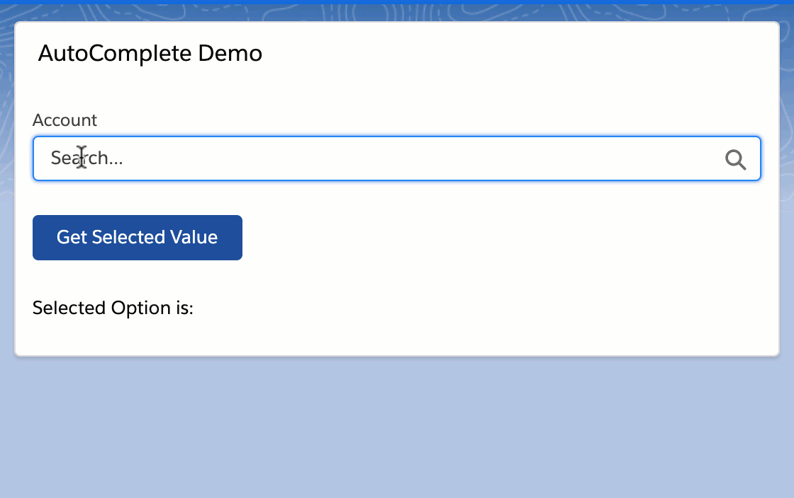

# AutoComplete-Lightning-Component
<h2>A custom component which will allow the user to search for records from Salesforce objects and create a dropdown populated with matching records.</h2>

<h3>The component can query records from any Salesforce object and can display matching records as a drop down. It accepts a few attributes which give you the power to control the component as per your use case.</h3>

<strong>label</strong> - String type attribute. Display a label over the component if a value is supplied.

<strong>objectApiName</strong> - String type attribute. Supply the API name of the object you want to query.

<strong>idFieldApiName</strong> - String type attribute. Supply the API name of Id field you want to fetch. Most of the times you want to standard Id field of the record, but in case, you want any other field to act as an Id field in the dropdown, you can simply provide the API name of the field.

<strong>valueFieldApiName</strong> - String type attribute. Supply the API name of the field you want to get value from. The values are displayed in the dropdown.

<strong>extendedWhereClause</strong> - String type attribute. The component can also take additional where clause for backend query. Use this attribute to supply additional conditions to your query. Example:
'AND Amount > 1000'

<strong>maxRecords</strong> - Number type attribute. The maximum matching records you want to fetch and display as dropdown. Default is 10.

<h3>Below are some of the examples of how you can invoke the component:</h3>
1. Fetching Account Records with Name-

<code><c:AutoComplete aura:id="account-records" label="Account" objectApiName="Account" idFieldApiName="Id" valueFieldApiName="Name" /></code>

2. Fetching Opportunity Records with Name having Amount>1000 -

<code><c:AutoComplete aura:id="opp-record" label="Opportunity" objectApiName="Opportunity" idFieldApiName="Id" valueFieldApiName="Name" extendedWhereClause="AND Amount>1000"/></code>

3. Fetching record from custom object "Car__c", here Id field is a custom field "Car_External_Id__c", value field is standard "Name" field, max record fetched can be 20 - 

<code><c:AutoComplete aura:id="car-record" label="Car" objectApiName="Car__c" idFieldApiName="Car_External_Id__c" valueFieldApiName="Name"  maxRecords="10"/></code>

